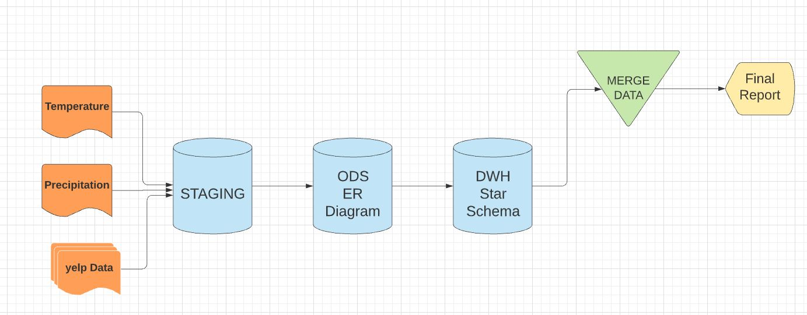
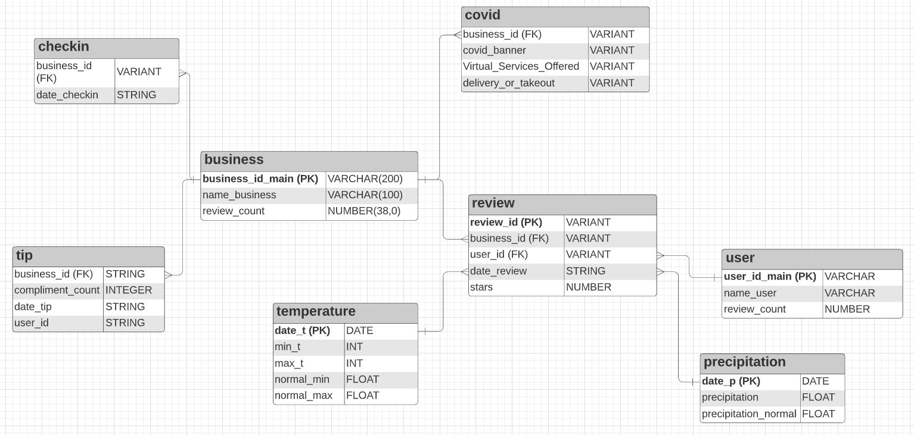
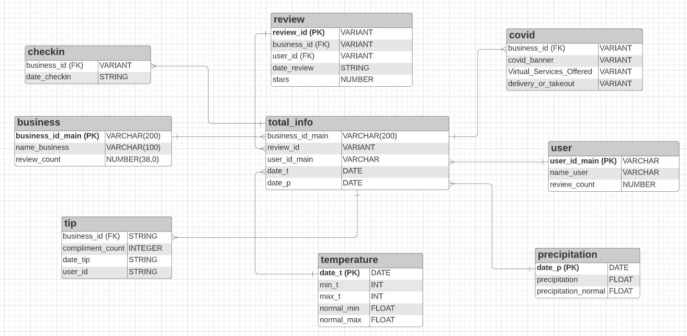
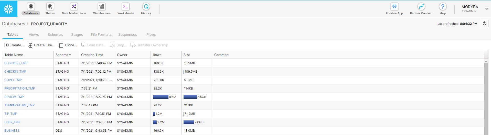
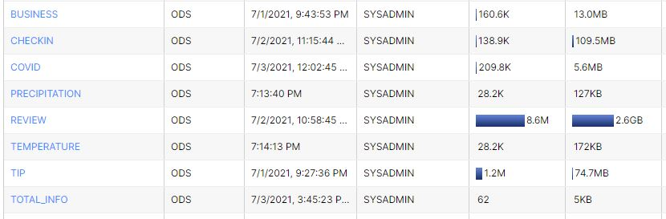
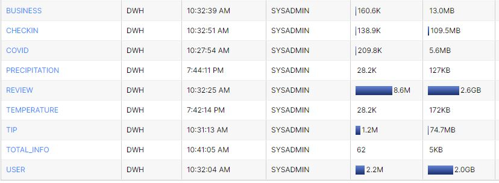

# Snowflake_Project (Nanodegree Data Architect - Udacity)

In this project scenario, I will use actual [YELP](https://www.yelp.com/dataset/download) and [climate datasets](https://crt-climate-explorer.nemac.org/) of Las Vegas in order to analyze the effects the weather has on customer reviews of restaurants. The data for temperature and precipitation observations are from the Global Historical Climatology Network-Daily (GHCN-D) database. I will use a leading industry **cloud-native data warehouse system called Snowflake** for all aspects of the project.

I will then apply the skills I have acquired in the preceding Designing Data Systems Course to architect and design a Data Warehouse DWH for the purpose of reporting and online analytical processing (OLAP).

## Data Architecture

## ER Diagram

## Star Schema

## STAGING Information

## Operational Data Store Information

## Data Warehouse Information

